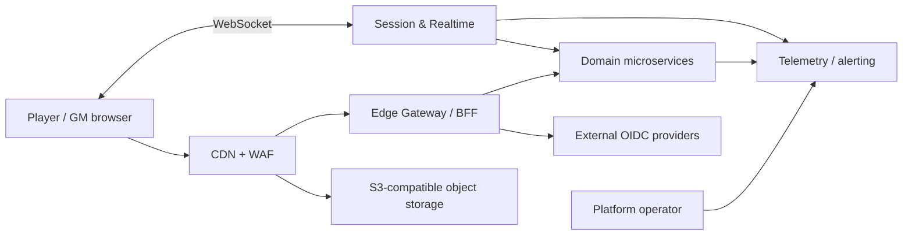
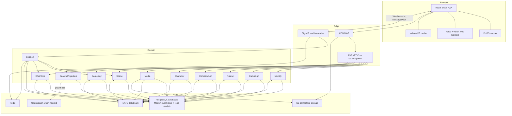
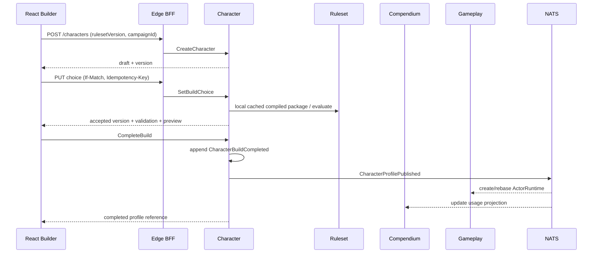
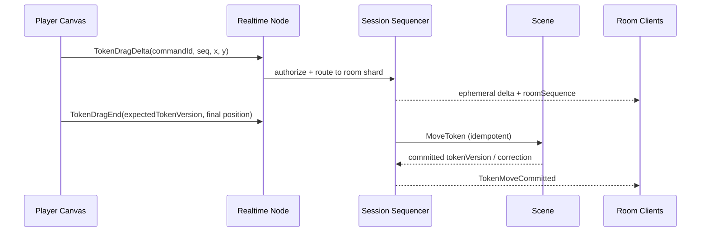
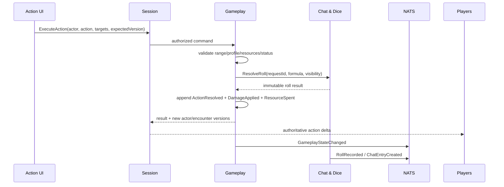

# Верхнеуровневая архитектура

Статус: `Proposed target architecture`.

## 1. Архитектурный стиль

Система состоит из independently deployable сервисов, выровненных по bounded
contexts. Внутри сервиса применяется layered/hexagonal architecture:

`API/Consumers → Application commands/queries → Domain → Ports → Infrastructure`.

Запрещён общий `Domain`-проект с сущностями всех сервисов. Разрешены небольшие
platform packages: event envelope, observability, auth middleware, result/error
types и test fixtures. Они не содержат бизнес-правил.

Микросервисность — граница владения и выпуска, а не требование выделять машине по
сервису. Alpha использует совместное размещение контейнеров; production может
масштабировать hot paths независимо.

## 2. Системный контекст

## 3. Микросервисы и bounded contexts

| Сервис | Bounded context / владение | Основная нагрузка |
|---|---|---|
| Edge Gateway / BFF | внешний контракт, композиция read models, rate limits | HTTP, auth edge |
| Identity & Access | account, credentials, platform sessions, consent | security-sensitive |
| Campaign | campaign, membership, invitations, ACL/policies | authorization writes |
| Ruleset | system schemas, mechanics, DSL, immutable versions | compile/evaluate rules |
| Compendium | content packs/entries, license/provenance | content read/search |
| Character | character build/progression, choices, loadout, derived profile | complex aggregate writes |
| Media | upload lifecycle, metadata, derivatives, quotas | object processing |
| Scene | persistent scene setup, walls/lights/tokens/fog checkpoints | spatial state |
| Session & Realtime | rooms, presence, join tickets, ordered transient deltas | WebSocket fan-out |
| Gameplay & Encounter | actor runtime, HP/resources/statuses, initiative/actions | authoritative automation |
| Chat & Dice | messages, macros, immutable rolls, RNG | append-heavy |
| Search & Projections | cross-context denormalized read/search views | eventually consistent reads |

Платформенные зависимости (NATS, PostgreSQL, Redis, object storage,
OpenTelemetry collector) не являются bounded contexts и не публикуют доменные API.

## 4. Контейнерная схема

Стрелки к `PG` означают отдельные logical database/schema credentials на сервис;
прямые cross-service joins запрещены. На старте несколько баз могут жить в одном
HA PostgreSQL cluster, затем горячие базы переносятся без смены контрактов.

## 5. Технологический стек

### Backend

- **.NET 10 LTS**, ASP.NET Core 10. На дату среза .NET 10 активен до 2028-11-14
  согласно [официальной support policy](https://dotnet.microsoft.com/en-us/platform/support/policy/dotnet-core).
- C# с nullable reference types, analyzers и warnings-as-errors для production code.
- ASP.NET Core Minimal APIs для focused endpoints; SignalR + MessagePack protocol
  для real-time; gRPC только для измеренных внутренних hot paths.
- Command/query handlers через собственные узкие интерфейсы; FluentValidation для
  boundary validation. Domain model не зависит от framework mediator.
- PostgreSQL + Marten для event streams/snapshots/projections; Dapper или EF Core
  для специализированных read models. Один aggregate stream — одна optimistic
  concurrency boundary.
- Npgsql; UUIDv7; JSONB только для versioned documents, не как замена модели.
- NATS JetStream для durable integration events и work queues; outbox/inbox.
- Redis для presence, short-lived join tickets, distributed rate limits и
  realtime node routing. Redis не является source of truth.
- S3-compatible storage (MinIO local; managed S3/R2-compatible production).
- OpenSearch вводится после доказанной нехватки PostgreSQL FTS/facets, а не в MVP.
- SixLabors.ImageSharp/libvips-based isolated media worker; ClamAV or provider
  malware scan; никогда не декодировать untrusted media в API process.

### Frontend

- **React 19.2**, TypeScript strict; это latest major/minor на дату среза по
  [официальной странице React versions](https://react.dev/versions).
- Vite current stable, версии фиксируются lockfile; pnpm workspace.
- TanStack Query для server state; Zustand/Redux Toolkit допустимы только для
  UI/session state, но не для дублирования всего server cache.
- PixiJS/WebGL2 для canvas; WebGPU как progressive enhancement после profiling.
- Web Workers + OffscreenCanvas where supported для visibility polygons, grid
  indexing, rules preview и тяжёлой обработки.
- IndexedDB/Dexie для immutable assets metadata, ruleset cache, scene snapshot и
  pending idempotent commands; Service Worker для app shell.
- React Testing Library, Vitest, Playwright; axe-core accessibility checks.

### Delivery и эксплуатация

- Monorepo: `src/services/*`, `src/web`, `contracts`, `tests`, `deploy`, `docs`.
- Docker/Compose local; OCI images; Kubernetes + Helm только production growth
  tier. Малый pilot допустимо запускать на orchestrated VMs.
- OpenTofu/Terraform для инфраструктуры; GitHub Actions CI/CD; SBOM, image scan,
  signed artifacts и provenance.
- OpenTelemetry SDK/Collector, Prometheus, Grafana, Loki, Tempo, Serilog.
- OpenAPI 3.1, AsyncAPI 3, JSON Schema/Protobuf для contracts; generated clients.

### Почему не GraphQL как основной write API

Команды имеют доменную семантику, идемпотентность и ожидаемую версию агрегата;
это прозрачнее в command endpoints. BFF может позже предоставить GraphQL для
сложных read-only экранов, но не становится владельцем доменных данных.

## 6. Ruleset architecture

Ruleset package состоит из:

- `manifest`: system id, semantic version, locale variants, dependencies, license;
- typed schemas: character sections, fields, resources, choices, content types;
- definitions: abilities/classes/features/items/spells/conditions/actions;
- expression AST: arithmetic, dice expression references, conditions, selectors;
- modifier algebra: add/set/min/max/multiply, advantage, grants, resistance;
- dependency graph и evaluation order;
- presentation metadata: labels/icons/layout hints, но не executable React code;
- migrations from compatible previous versions;
- golden examples и expected calculations.

Published version immutable. Кампания pin-ит точную версию; migration выполняется
командой с отчётом о несовместимых choices. Серверный engine является истиной,
а browser-реализация используется для мгновенного preview и сверяется contract
fixtures. Будущий advanced extension допускает signed WASM с capability/time/
memory limits, но не входит в initial platform.

## 7. Согласованность и взаимодействие

- Внутри агрегата: strong consistency через expected stream version.
- Между агрегатами одного сервиса: process manager + события; транзакция только
  где владелец и инвариант действительно общие.
- Между сервисами: at-least-once events, idempotent consumers, no distributed 2PC.
- UI read models: eventual consistency с `projectionVersion` и явным pending state.
- Для команды, ответ которой нужен пользователю сейчас, сервис возвращает accepted
  aggregate version и minimal result; projection может догнать позже.
- Cross-service orchestration хранит state machine, timeout и compensation; нельзя
  строить длинную цепочку синхронных HTTP вызовов.

## 8. Основные потоки

### Создание персонажа

Ruleset evaluation в steady state использует локальный immutable compiled package,
полученный по event/cache; синхронный вызов Ruleset в диаграмме — cache miss/admin
flow, а не обязательный hop каждого изменения.

### Перемещение токена

Курсор и промежуточные координаты имеют TTL и не event-source-ятся. Финальное
перемещение, если оно изменяет игровое состояние, сохраняется.

### Атака и урон

Если dice вынесен в отдельный сервис, `ResolveRoll` имеет строгий timeout и
idempotent request id. Для минимизации latency допустима библиотека RNG/formula
в Gameplay, но владелец immutable roll record и публичного контракта остаётся
Chat & Dice; выбор фиксируется ADR после load prototype.

## 9. Развёртывание по масштабу

### Local

Все сервисы и зависимости в Compose; frontend dev server. Опционально service
profiles позволяют поднимать только нужные bounded contexts.

### Pilot

Два app nodes за load balancer, отдельный worker node, managed/HA PostgreSQL или
проверенная primary+replica, Redis, NATS, object storage/CDN. Несколько сервисных
контейнеров совместно размещены, но имеют отдельные credentials, health checks и
deployable images.

### Growth

Kubernetes, HPA по CPU + WebSocket connections + queue lag, dedicated realtime
node pools, PostgreSQL clusters grouped by workload, NATS cluster, Redis HA,
multi-AZ object storage/CDN. Campaign/session получает `regionId` и `roomShard`.

### Large scale

Region-affine campaigns, global routing to home region, read-only global content
replication, independent scene/chat/gameplay shards. Active-active mutation одной
кампании не требуется; controlled failover проще и безопаснее для ordering.

## 10. Архитектурные запреты

- общий database/schema или cross-service SQL join;
- synchronous request chain глубже двух domain hops в interactive path;
- произвольный JS/C# из ruleset, macro или compendium;
- event с полным access token/PII/защищённым текстом без необходимости;
- использование Redis/cache как canonical state;
- долговечное хранение каждого cursor/drag/presence delta;
- authorization только в UI или BFF;
- изменение опубликованного event payload задним числом;
- unbounded list endpoint, dice count, formula recursion, upload или WebSocket frame;
- слепая ретрансляция domain event клиенту без client-specific schema и ACL.
