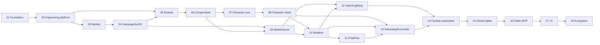

# Подробный roadmap разработки VTT Platform

Статус: `Approved structure / steps planned`  
Версия: `1.0`  
Дата: 2026-08-14

Этот roadmap — рабочий контракт нашей разработки. Этап завершается не после
написания кода, а только после выполнения Definition of Done, ручной приёмки и
критического Go/No-Go check. Календарные сроки назначаются отдельно после оценки
скорости команды; порядок и зависимости являются обязательными.

## Как мы работаем

- Владелец продукта подтверждает пользовательский результат, спорные UX/правовые
  решения и принимает ручную проверку.
- Исполнитель реализует код, автоматические тесты, миграции, telemetry, инструкции
  запуска и собирает evidence для приёмки.
- Один этап может состоять из нескольких небольших PR; рекомендуемый порядок:
  contracts/ADR → domain → infrastructure → API → frontend → E2E/operations.
- Одновременно в состоянии `In progress` находится один критический этап. Допустима
  подготовка DoR следующего этапа, если она не меняет код текущего результата.
- Любое изменение scope записывается в requirements/service docs до реализации.
- Незавершённые функции закрыты feature flag и не ухудшают пройденный путь.
- Статусы: `Planned → Ready → In progress → Manual acceptance → Critical review → Done`.

## Последовательность этапов

| № | Этап | Главный результат | Зависит от |
|---:|---|---|---|
| 01 | [Подготовка solution и local environment](step-01-project-foundation.md) | Структура, заглушки .NET/React, Docker Compose | — |
| 02 | [Engineering platform](step-02-engineering-platform.md) | CQRS/ES, contracts, outbox/inbox, CI, observability | 01 |
| 03 | [Identity & Access](step-03-identity-access.md) | Безопасная регистрация, вход и browser session | 02 |
| 04 | [Campaign и authorization](step-04-campaign-authorization.md) | Кампании, роли, приглашения, ACL projection | 03 |
| 05 | [Ruleset engine](step-05-ruleset-engine.md) | Безопасная DSL, compile/publish, deterministic parity | 02, 04 |
| 06 | [Compendium и SRD pipeline](step-06-compendium.md) | Версионируемый лицензированный контент и поиск | 04, 05 |
| 07 | [Character Builder: основа](step-07-character-builder-core.md) | Draft wizard, характеристики, происхождение, класс | 05, 06 |
| 08 | [Character: progression и playable sheet](step-08-character-progression-sheet.md) | Уровень N, HP, spells, inventory, effects, sheet | 07 |
| 09 | [Media и Scene foundation](step-09-media-scene.md) | Загрузка карт, grid/layers и tokens | 04, 06 |
| 10 | [Session & Realtime](step-10-session-realtime.md) | Совместная комната, movement, reconnect/resync | 08, 09 |
| 11 | [Chat, Dice и Macros](step-11-chat-dice.md) | История чата, safe formulas, server RNG | 05, 10 |
| 12 | [Fog, walls, lighting и vision](step-12-vision-lighting.md) | Авторизованное видение и быстрый canvas | 09, 10 |
| 13 | [Gameplay Runtime и Encounter](step-13-gameplay-encounter.md) | HP/resources/statuses, initiative, turns | 08, 10, 11 |
| 14 | [Combat automation](step-14-combat-automation.md) | Attack/save/damage/ammo/effects/rest/compensation | 12, 13 |
| 15 | [Закрытая alpha](step-15-closed-alpha.md) | Полный vertical slice и 100 CCU hardening | 01–14 |
| 16 | [Публичный MVP](step-16-public-mvp.md) | 1 000 CCU, accessibility, SLO, DR, privacy | 15 |
| 17 | [Полноценная V1](step-17-v1-enrichment.md) | Journals, audio, homebrew, import/export, calendar | 16 |
| 18 | [Экосистема и масштабирование](step-18-ecosystem.md) | Вторая система, sandbox plugins, LFG/video/regions | 17 |

## Зависимости



## Глобальный Definition of Ready

Этап не переводится в `Ready`, пока не выполнено применимое:

- [ ] пользовательский результат и out-of-scope сформулированы однозначно;
- [ ] затрагиваемые bounded contexts и единственный владелец каждого нового
  состояния определены;
- [ ] UI flow/wireframe или API consumer flow согласован;
- [ ] команды, read models, integration events и ошибки набросаны в contract-first
  виде; breaking changes названы;
- [ ] правила authorization/privacy/licensing определены;
- [ ] acceptance examples и критические ручные сценарии подготовлены до кода;
- [ ] миграция/rollback/feature flag стратегия определена;
- [ ] внешние зависимости доступны локально и в CI;
- [ ] performance/security risks имеют проверяемую гипотезу;
- [ ] нет открытого blocker из critical review предыдущего этапа.

## Глобальный Definition of Done

Этап не переводится в `Done`, пока не выполнено применимое:

- [ ] scope и acceptance examples реализованы, out-of-scope не замаскирован;
- [ ] `dotnet build/test`, frontend lint/typecheck/test и contract checks зелёные;
- [ ] domain/application line coverage ≥90%, общий production code ≥80% либо
  документирован временный baseline; критический core имеет mutation tests;
- [ ] integration tests используют реальные PostgreSQL/NATS/Redis/MinIO через
  Testcontainers там, где зависимость затронута;
- [ ] OpenAPI/AsyncAPI/schemas, docs и generated TypeScript client обновлены;
- [ ] authorization, idempotency, concurrency и tenant isolation проверены;
- [ ] telemetry, dashboards/alerts и log redaction добавлены;
- [ ] migration forward/rollback или expand-contract проверены;
- [ ] ручной test plan выполнен с датой, сборкой, окружением и результатами;
- [ ] critical review имеет письменный `GO`, отсутствуют P0/P1 defects;
- [ ] инструкции запуска/восстановления понятны человеку без авторов изменения.

## Шаблон отчёта ручного тестирования

В PR или `docs/test-reports/<step>/<date>.md` фиксируется:

```text
Step / build / commit:
Environment / browser / device:
Tester / date:
Test data and feature flags:
Passed cases:
Failed cases + issue links:
Screenshots/log/trace ids (без секретов и PII):
Regression smoke result:
Residual risks:
Acceptance decision:
```

## Критический Go/No-Go

На завершении этапа мы отдельно отвечаем не «работает ли happy path», а:

1. Не появилось ли два владельца одного состояния?
2. Можно ли повторить command/event без двойного эффекта?
3. Может ли пользователь одной кампании увидеть/изменить данные другой?
4. Что произойдёт при stale version, timeout, retry, partial failure и restart?
5. Можно ли восстановить state/projection и откатить deployment?
6. Не попали ли PII, token, invite code, hidden roll или GM-only data в лог/cache/bus?
7. Не выполняется ли пользовательский код и ограничены ли payload/cost?
8. Выполняется ли performance budget на слабом reference device и target load?
9. Покрывает ли лицензия распространяемый контент/asset?
10. Может ли следующая фича использовать contract, не читая чужую БД?

Ответ `нет данных` на критический вопрос означает `NO-GO` и отдельную задачу на
эксперимент. P0/P1 defect нельзя переносить в следующий этап как «известное
ограничение», если он затрагивает безопасность, потерю данных или корректность.

## Release milestones

- **Architecture runway:** steps 01–06.
- **Killer-feature playable slice:** steps 07–14.
- **Closed alpha:** step 15.
- **Public MVP:** step 16.
- **V1:** step 17.
- **Ecosystem:** step 18.

High-level product phases и риски остаются в
[product roadmap](../product/roadmap.md); этот каталог является исполняемым планом.
