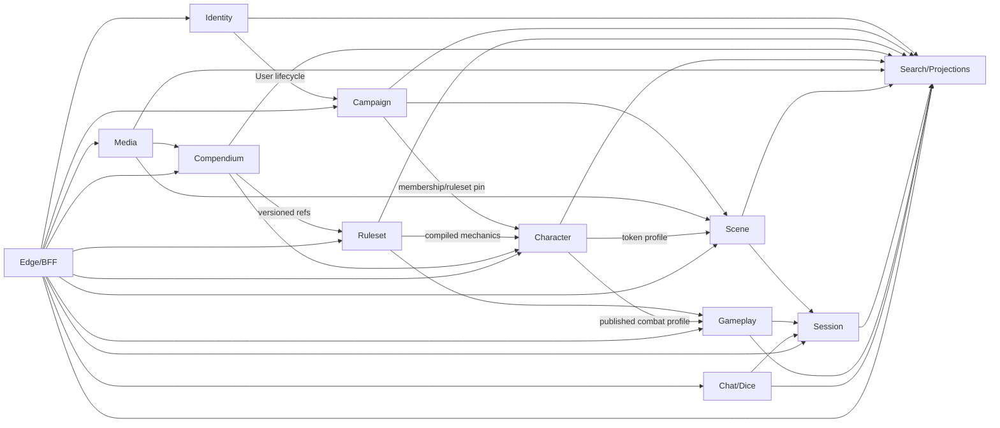

# Микросервисы: карта, контракты и общие правила

Статус: `Proposed`.

## 1. Карта владения

| Данные/решение | Единственный владелец |
|---|---|
| Account, credentials, refresh sessions | Identity & Access |
| Campaign membership, invite, campaign-level policy | Campaign |
| Rules DSL/schema/version/compiled package | Ruleset |
| Content pack/entry/license/provenance | Compendium |
| Character build choices/progression/equipment loadout/profile | Character |
| Binary asset lifecycle/derivatives/quota | Media |
| Persistent scene geometry/tokens/fog checkpoints | Scene |
| Presence, join ticket, room sequence, transient deltas | Session & Realtime |
| Current HP/resources/ammo/status, encounter/action result | Gameplay & Encounter |
| Message, macro, immutable dice result | Chat & Dice |
| Cross-context search/composite read document | Search & Projections |
| Public routing/composition | Edge Gateway/BFF; не canonical domain data |

Если поле выглядит общим, оно либо ссылка (`CharacterId`), либо локальная projection
с `sourceVersion`. Два сервиса не принимают независимые команды к одной сущности.

## 2. Context relationships



## 3. Public API conventions

Base: `/api/v1`. Edge exposes public routes and forwards only to owning service.
Internal service API may иметь отдельный host/prefix, но сохраняет resource names.

### Headers

| Header | Назначение |
|---|---|
| `Authorization: Bearer …` или secure BFF cookie | principal; browser tokens не в localStorage |
| `Idempotency-Key` | обязателен для non-idempotent command POST |
| `If-Match: "version"` | expected aggregate/resource version для изменения |
| `If-None-Match` | conditional query/cache |
| `X-Correlation-Id` | клиент может предложить UUID; сервер валидирует/заменяет |
| `traceparent` | W3C distributed tracing |
| `Accept-Language` | UI/content locale hint, не часть identity |

`campaignId/tenantId` берётся из route/resource и проверяется по claims/policy;
клиентский произвольный tenant header не считается авторизацией.

### Response shapes

Command success:

```json
{
  "data": {},
  "meta": {
    "aggregateVersion": 12,
    "projectionPending": true,
    "correlationId": "0198..."
  }
}
```

Query list:

```json
{
  "items": [],
  "page": { "nextCursor": null, "limit": 50 },
  "meta": { "asOf": "2026-08-14T12:00:00Z", "projectionVersion": 42 }
}
```

Ошибки — `application/problem+json` RFC 9457 с stable `code`, `traceId`,
field errors и optional `currentVersion`. Нельзя возвращать stack trace.

Основные статусы: `200/201`, `202 + Location` для operation, `204`, `400` shape,
`401`, `403/404` по disclosure policy, `409` invariant/concurrency, `412`
precondition, `413`, `422` semantically invalid draft, `429`, `503` degraded.

### Pagination/filtering

- cursor, не offset, для изменяемых больших коллекций;
- `limit` default 50, max 200;
- sort поля allowlisted, cursor подписан/opaque;
- list response не содержит скрытые объекты, count не раскрывает их число;
- text query max 200 chars; filters/ids bounded.

### Operations

Долгая операция:

- `GET /api/v1/operations/{operationId}` → status, progress, result/error;
- `DELETE /api/v1/operations/{operationId}` → best-effort cancel, если operation
  явно cancellable;
- operation scoped principal/campaign and expires by policy.

## 4. Internal contracts

- Sync HTTP/gRPC только для короткой проверки/вычисления, которой нужен immediate
  result; deadline ≤1 сек interactive path.
- Durable facts — NATS JetStream + AsyncAPI; commands через bus только для
  background workflows с operation state.
- Service-to-service identity, audience-scoped token/mTLS; user context передаётся
  как signed claims subset, но owner всё равно проверяет policy revision.
- Consumer stores source `aggregateId/version/eventId`; handler idempotent.
- Нельзя публиковать DB row-shaped event или заставлять consumer понимать
  producer internals.

## 5. Versioning

- Public API: path major `/v1`; additive fields compatible.
- WebSocket protocol: `protocolVersion`, negotiated at connect; current + previous
  supported during rolling deployment.
- Event type suffix `.v1`; breaking semantics → `.v2`, dual publish during window.
- Ruleset/content versions independent from platform API versions.
- ETag/aggregate version — concurrency token, не semantic version.

## 6. Authorization flow

1. Identity authenticates principal.
2. Campaign owns membership/policy revision and publishes compact projections.
3. Edge prefilters/rate-limits, но не является единственной защитой.
4. Owning service loads local policy projection and object-specific ACL.
5. При critical stale/unknown revision command fails closed or makes bounded
   Campaign authorization check.
6. Session mints short-lived join ticket after checking all policies; every
   realtime command still validates allowed capability/object.

## 7. Naming commands and events

Use domain language:

- route action may be `/encounters/{id}/actions`;
- application command `ExecuteAction`;
- domain events `AttackRollResolved`, `DamageApplied`, `AmmunitionSpent`;
- integration event `ActionResolved.v1`.

Не использовать `UpdateEntity`, `EntityChanged` там, где можно назвать намерение.

## 8. Documentation contract

Каждый service document ниже фиксирует bounded context, aggregates/entities,
events, relations, API и key tests. Перед реализацией таблицы endpoints переносятся
в OpenAPI с examples; события — AsyncAPI/JSON Schema. Расхождение generated spec
и Markdown исправляется в той же PR.
